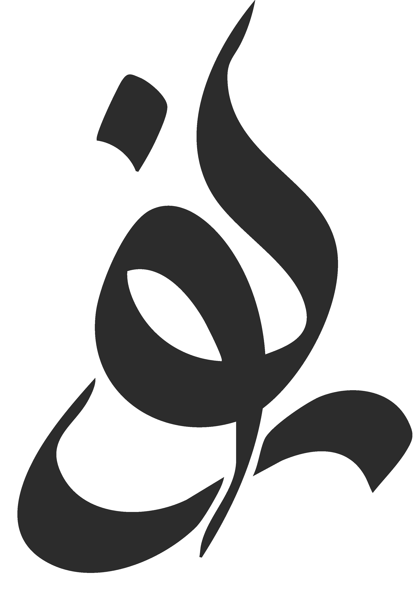
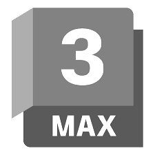
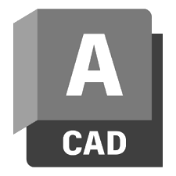

# README_Technical - Noor Al-Huwaidi Portfolio
## Comprehensive Technical Documentation

**Project Name:** Noor Al-Huwaidi Interior Design Portfolio  
**Version:** 1.0.0  
**Last Updated:** February 16, 2026  
**Developer:** Awwab Mohammed  
**Designer/Subject:** Noor Al-Huwaidi

---

## Table of Contents

1. [Project Overview](#project-overview)
2. [Technology Stack](#technology-stack)
3. [Project Structure](#project-structure)
4. [CSS Architecture](#css-architecture)
5. [HTML Structure & Semantics](#html-structure--semantics)
6. [JavaScript Architecture](#javascript-architecture)
7. [Responsive Design Implementation](#responsive-design-implementation)
8. [Modal System Implementation](#modal-system-implementation)
9. [Navigation System](#navigation-system)
10. [Performance Optimization](#performance-optimization)
11. [Accessibility Features](#accessibility-features)
12. [Browser Compatibility](#browser-compatibility)
13. [File-by-File Technical Breakdown](#file-by-file-technical-breakdown)
14. [Design System](#design-system)
15. [Future Enhancement Recommendations](#future-enhancement-recommendations)

---

## Project Overview

### Purpose
A sophisticated, modern portfolio website for Noor Al-Huwaidi, an interior designer based in Saudi Arabia. The site showcases design philosophy, professional experience, technical skills, and completed projects through an immersive, visually-driven web experience.

### Key Features
- **Multi-page Structure**: Distributed content across 5 distinct HTML pages
- **Interactive Modals**: Dynamic project showcase with lightbox-style modal system
- **Timeline Visualization**: Career path displayed using CSS-based timeline with alternating layout
- **Responsive Design**: Mobile-first approach with breakpoints at 768px and 900px
- **Fixed Navigation**: Header remains accessible during page scroll with backdrop blur
- **Image Gallery**: WebP format support with floating animation effects
- **Contact Integration**: WhatsApp integration and email contact methods
- **Smooth Scrolling**: Native HTML scroll-behavior and JavaScript-enhanced navigation

### Target Audience
- Potential clients seeking interior design services
- Project collaborators and creative professionals
- Design industry stakeholders
- Property developers and real estate professionals

---

## Technology Stack

### Frontend Technologies
- **HTML5**: Semantic markup and accessibility
- **CSS3**: Advanced layout, animations, and responsive design
- **JavaScript (ES6)**: DOM manipulation and interactivity
- **Font Awesome 4.7.0**: Icon library for social links and contact icons

### Tools & Build Systems
- **Node.js**: Package management via npm
- **Optimization**: Image optimization tool (optimizt) for WebP conversion

### Image Formats
- **Primary Format**: WebP (modern, optimized)
- **Fallback Format**: JPG/PNG (browser compatibility)
- **Location**: `/images/` directory with organized subdirectories

### External Dependencies
```json
{
  "name": "Noor_Portfolio",
  "version": "1.0.0",
  "main": "index.js",
  "private": true
}
```

**Note:** This is a static site with no npm dependencies. All styling and interactivity are vanilla JavaScript and CSS.

---

## Project Structure

```
Noor_Portfolio/
├── index.html                    # Landing page with hero and project teaser
├── about.html                    # Designer bio and service offerings
├── cv.html                       # Full curriculum vitae and professional history
├── showroom.html                 # Complete project portfolio with modals
├── journal.html                  # Disabled blog/journal section (hidden via CSS)
├── style.css                     # Master stylesheet (all pages)
├── index.js                      # Minimal entry point
├── package.json                  # Project metadata
├── README.md                     # Standard project README
├── README_Technical.md           # This file - comprehensive technical docs
│
├── images/                       # Media assets directory
│   ├── Navigation_logo.png       # Logo used in navigation (40px height)
│   ├── Sketch2.png              # Profile image on about page
│   ├── favicon.ico              # Browser tab icon
│   ├── logos/                   # Software proficiency logos
│   │   ├── 3dsmax.png
│   │   ├── autocad.png
│   │   ├── revit.png
│   │   ├── photoshop.png
│   │   ├── illustrator.png
│   │   ├── procreate.png
│   │   ├── cinema4d.png
│   │   ├── vray.png
│   │   ├── blender.png
│   │   └── shapr3d.png
│   ├── Airbnb/                  # Project folder
│   ├── Clay_Chai/               # Project folder with WebP images
│   ├── Crimson_Haven/           # Project folder
│   ├── experts_decision/        # Project folder
│   ├── Modern_Retreat/          # Project folder
│   ├── Oasis_of_Serenity/       # Project folder
│   ├── Redbull/                 # Project folder
│   ├── The_Symphony_of_Warm_Elegance/  # Project folder
│   ├── Ultimate/                # Project folder
│   └── Warm_Aura/               # Project folder
│
└── resources/                    # Documentation and assets
    └── Noor Alhuwidi CV.pdf     # Downloadable PDF CV
```

### Image Directory Structure
Each project folder contains multiple WebP images for the project gallery:
```
images/Clay_Chai/
├── 1.webp
├── 2.webp
├── 3.webp
├── 4.webp
├── 5.webp
└── ...
```

---

## CSS Architecture

### 1. CSS Variables (Design Tokens)

Located in `:root` selector for global scope and easy theming:

```css
:root {
    --bg-color: #f9f9f7;              /* Light beige background */
    --text-main: #2c2c2c;             /* Dark text for primary content */
    --text-light: #666666;            /* Secondary/paragraph text */
    --accent: #8c7b6c;                /* Warm tan/brown accent color */
    --accent-dark: #5e5044;           /* Darker accent for headings */
    --white: #ffffff;                 /* Pure white */
    --shadow: 0 10px 30px rgba(0,0,0,0.05);  /* Subtle drop shadow */
    --transition: all 0.4s ease;      /* Standard animation duration */
    --font-heading: 'Georgia', 'Times New Roman', serif;  /* Serif for elegance */
    --font-body: 'Helvetica Neue', Helvetica, Arial, sans-serif;  /* Clean sans-serif */
}
```

**Design Philosophy:**
- **Color Palette**: Warm, earthy, professional aesthetic reflecting interior design discipline
- **Typography**: Combination of serif (headings) and sans-serif (body) for visual hierarchy
- **Transitions**: 0.4s ease provides smooth, professional animations

### 2. Reset & Base Styles

```css
* {
    margin: 0;
    padding: 0;
    box-sizing: border-box;  /* Include padding/border in width calculations */
}

html {
    scroll-behavior: smooth;  /* Native smooth scrolling for anchor links */
}

body {
    font-family: var(--font-body);
    background-color: var(--bg-color);
    color: var(--text-main);
    line-height: 1.6;  /* Optimal readability */
    overflow-x: hidden;  /* Prevent horizontal scrollbar */
}

a {
    text-decoration: none;
    color: inherit;  /* Inherit parent color unless overridden */
}

ul {
    list-style: none;  /* Remove default bullets */
}

img {
    max-width: 100%;  /* Responsive images */
    display: block;  /* Remove inline spacing */
}
```

### 3. Typography System

```css
h1, h2, h3, h4 {
    font-family: var(--font-heading);  /* Georgia serif */
    font-weight: normal;               /* No bold headings */
    line-height: 1.2;                  /* Tighter line height for headings */
}

h2 {
    font-size: 2.5rem;
    margin-bottom: 2rem;
    text-align: center;
    color: var(--accent-dark);  /* Dark brown */
    position: relative;
    display: inline-block;
    left: 50%;
    transform: translateX(-50%);  /* Center using transform (GPU-efficient) */
}

h2::after {
    content: '';
    display: block;
    width: 60px;
    height: 2px;
    background: var(--accent);
    margin: 10px auto 0;  /* Decorative underline below h2 */
}

p {
    margin-bottom: 1rem;
    color: var(--text-light);  /* Lighter gray for readability */
}
```

### 4. Layout Containers

```css
.container {
    max-width: 1200px;  /* Content width limit */
    margin: 0 auto;     /* Horizontal centering */
    padding: 0 20px;    /* Side padding on mobile */
}

section {
    padding: 80px 0;    /* Vertical breathing room */
}
```

### 5. Navigation Styles

#### Fixed Navigation Bar
```css
nav {
    padding: 20px 0;
    position: fixed;            /* Stays visible during scroll */
    top: 0;
    left: 0;
    width: 100%;
    z-index: 100;               /* Ensures it overlays content */
    background: rgba(249, 249, 247, 0.95);  /* Semi-transparent with slight blur */
    backdrop-filter: blur(5px); /* Glassmorphic effect (CSS backdrop blur) */
    border-bottom: 1px solid rgba(0,0,0,0.05);
}

.nav-inner {
    display: flex;
    justify-content: space-between;  /* Logo left, links right */
    align-items: center;
}
```

#### Logo Container (Image + Text)
```css
.logo-container {
    display: flex;
    align-items: center;        /* Vertical centering */
    gap: 15px;                  /* Space between logo and text */
    text-decoration: none;
    cursor: pointer;
}

.logo-img {
    height: 40px;               /* Fixed height for consistency */
    width: auto;                /* Proportional width */
    display: block;
}

.logo-text {
    font-family: var(--font-heading);
    font-size: 1.5rem;
    font-weight: normal;
    letter-spacing: 1px;        /* Elegant spacing */
    text-transform: uppercase;  /* NOOR AL-HUWAIDI */
    color: var(--text-main);
    line-height: 1;
}
```

#### Navigation Links
```css
.nav-links a {
    margin-left: 30px;
    font-size: 0.9rem;
    text-transform: uppercase;
    letter-spacing: 1px;
    position: relative;
    color: var(--text-light);
    transition: var(--transition);  /* Smooth color change on hover */
}

.nav-links a:hover {
    color: var(--accent);  /* Highlight on interaction */
}
```

#### Hamburger Menu Toggle
```css
.nav-toggle {
    display: none;              /* Hidden on desktop */
    background: transparent;
    border: none;
    width: 44px;
    height: 44px;
    cursor: pointer;
    align-items: center;
    justify-content: center;
}

.nav-toggle span, 
.nav-toggle span::before,
.nav-toggle span::after {
    display: block;
    background: var(--text-main);
    height: 2px;
    width: 22px;
    border-radius: 2px;
    transition: transform 0.3s ease, opacity 0.3s ease;
    position: relative;
}

.nav-toggle span::before,
.nav-toggle span::after {
    content: '';
    position: absolute;
    left: 0;
}

.nav-toggle span::before { top: -7px; }
.nav-toggle span::after { top: 7px; }

/* Hamburger to X animation */
.nav-open .nav-toggle span { background: transparent; }
.nav-open .nav-toggle span::before { 
    transform: translateY(7px) rotate(45deg); 
}
.nav-open .nav-toggle span::after { 
    transform: translateY(-7px) rotate(-45deg); 
}
```

### 6. Section Styles

#### About Section
```css
#about {
    min-height: 100vh;          /* Full viewport height */
    display: flex;              /* Vertical centering */
    align-items: center;
    padding-top: 120px;         /* Space for fixed navbar */
}

.about-grid {
    display: grid;
    grid-template-columns: 1fr 1fr;  /* Two-column layout */
    gap: 60px;                       /* Space between columns */
    align-items: center;
}

.about-image {
    position: relative;
}

.about-image img {
    width: 100%;
    border-radius: 4px;
    box-shadow: var(--shadow);  /* Subtle shadow */
}

.about-content h1 {
    font-size: 3.5rem;
    margin-bottom: 1.5rem;
}
```

#### Contact Info Display
```css
.contact-info {
    margin-top: 2rem;
    padding-top: 2rem;
    border-top: 1px solid #ddd;
}

.contact-item {
    display: flex;
    align-items: center;
    margin-bottom: 1rem;
    font-size: 1.1rem;
}

.contact-icon {
    margin-right: 15px;
    width: 24px;
    height: 24px;
    fill: var(--accent);  /* Colored icons */
}
```

#### Button Styles
```css
.btn {
    display: inline-block;
    padding: 12px 30px;
    background-color: var(--text-main);  /* Dark button */
    color: var(--white);
    text-transform: uppercase;
    font-size: 0.8rem;
    letter-spacing: 2px;
    margin-top: 10px;
    transition: var(--transition);
    border: 1px solid var(--text-main);
    cursor: pointer;
}

.btn:hover {
    background-color: transparent;  /* Inverted on hover */
    color: var(--text-main);
}

.btn-whatsapp {
    background-color: #25D366;  /* WhatsApp green */
    border-color: #25D366;
    color: white;
}
```

### 7. CV Section - Timeline

```css
#cv {
    background-color: var(--white);
    position: relative;
}

.timeline {
    position: relative;
    max-width: 900px;
    margin: 0 auto;
}

/* Central vertical line */
.timeline::after {
    content: '';
    position: absolute;
    width: 2px;
    background-color: var(--accent);
    top: 0;
    bottom: 0;
    left: 50%;
    margin-left: -1px;  /* Center the line */
}

.cv-entry {
    padding: 10px 40px;
    position: relative;
    background-color: inherit;
    width: 50%;
    box-sizing: border-box;
    transition: var(--transition);
}

.cv-entry:hover {
    transform: translateY(-5px);  /* Subtle lift on hover */
}

/* Timeline circles */
.cv-entry::after {
    content: '';
    position: absolute;
    width: 16px;
    height: 16px;
    right: -8px;                   /* Position on the line */
    background-color: var(--bg-color);
    border: 3px solid var(--accent);
    top: 22px;
    border-radius: 50%;
    z-index: 1;
}

/* Left and right positioning */
.left { left: 0; }
.right { left: 50%; }
.right::after { left: -8px; }    /* Adjust right-side circles */

.cv-content {
    padding: 25px;
    background-color: var(--bg-color);
    border-radius: 4px;
    box-shadow: 0 4px 15px rgba(0,0,0,0.03);
    border: 1px solid rgba(0,0,0,0.05);
}

.cv-year {
    font-weight: bold;
    color: var(--accent);
    margin-bottom: 5px;
    display: block;
}
```

### 8. Skills Section

```css
.skills-column {
    display: flex;
    flex-direction: column;
    gap: 30px;  /* Vertical spacing between skill boxes */
}

/* Software Logo Grid */
.software-grid {
    display: grid;
    grid-template-columns: repeat(auto-fill, minmax(70px, 1fr));  /* Responsive columns */
    gap: 20px;
    align-items: center;
    padding-top: 10px;
}

.software-grid img {
    width: 100%;
    height: auto;
    max-height: 60px;
    object-fit: contain;        /* Preserve aspect ratio */
    display: block;
    margin: 0 auto;
    opacity: 0.8;
    transition: var(--transition);
}

.software-grid img:hover {
    opacity: 1;
    transform: scale(1.1);  /* Grow on hover */
}

/* Custom Skills List */
.skills-list {
    list-style: none;
    padding: 0;
}

.skills-list li {
    position: relative;
    padding-left: 25px;  /* Space for arrow */
    margin-bottom: 12px;
    color: var(--text-main);
}

.skills-list li::before {
    content: '→';           /* Right arrow bullet */
    position: absolute;
    left: 0;
    color: var(--accent);
    font-weight: bold;
}
```

### 9. Blog Section (Hidden)

```css
#blog {
    display: none;  /* Feature disabled */
    background-color: var(--bg-color);
}

.blog-grid {
    display: grid;
    grid-template-columns: repeat(auto-fit, minmax(300px, 1fr));
    gap: 30px;
}

.blog-card {
    background: var(--white);
    border-radius: 4px;
    overflow: hidden;
    box-shadow: var(--shadow);
    transition: var(--transition);
    display: flex;
    flex-direction: column;  /* Stack content */
    height: 100%;
    cursor: pointer;
}

.blog-card:hover {
    transform: translateY(-10px);  /* Lift effect */
}

.blog-img {
    height: 200px;
    overflow: hidden;
}

.blog-img img {
    width: 100%;
    height: 100%;
    object-fit: cover;
    transition: var(--transition);
}

.blog-card:hover .blog-img img {
    transform: scale(1.1);  /* Zoom image on hover */
}

.blog-content {
    padding: 25px;
    flex-grow: 1;  /* Fill remaining space */
}

.blog-tag {
    font-size: 0.75rem;
    text-transform: uppercase;
    color: var(--accent);
    letter-spacing: 1px;
    margin-bottom: 10px;
}
```

### 10. Showroom Section - Project Gallery

```css
#showroom {
    background-color: var(--bg-color);
}

/* Floating Animation Keyframes */
@keyframes gentleFloat {
    0% { transform: translateY(0px); }
    50% { transform: translateY(-10px); }
    100% { transform: translateY(0px); }
}

.project-gallery {
    display: grid;
    grid-template-columns: repeat(2, 1fr);  /* 2-column on desktop */
    gap: 40px;
}

.project-item {
    position: relative;
    cursor: pointer;
}

.project-visuals {
    position: relative;
    height: 450px;              /* Tall images */
    overflow: hidden;
    border-radius: 8px;
    margin-bottom: 20px;
}

.project-visuals img {
    width: 100%;
    height: 100%;
    object-fit: cover;
    animation: gentleFloat 8s ease-in-out infinite;  /* Subtle floating effect */
}

.project-info h3 {
    font-size: 1.8rem;
    margin-bottom: 0.5rem;
}

.project-link {
    color: var(--accent);
    font-weight: bold;
    text-transform: uppercase;
    letter-spacing: 1px;
    font-size: 0.8rem;
}
```

### 11. Modal System

#### General Modal Styles
```css
.modal {
    display: none;              /* Hidden by default */
    position: fixed;
    z-index: 1000;              /* Above everything */
    left: 0;
    top: 0;
    width: 100%;
    height: 100%;
    overflow: hidden;           /* No scrolling body behind */
    background-color: rgba(0,0,0,0.9);  /* Dark overlay */
    backdrop-filter: blur(5px);  /* Glassmorphic effect */
    opacity: 0;
    transition: opacity 0.3s ease;
}

.modal.show {
    opacity: 1;  /* Fade in */
}

.modal-content {
    display: grid;
    grid-template-columns: 1fr 1fr;  /* Image left, text right */
    gap: 40px;
    max-height: 90vh;
    overflow-y: auto;
    position: relative;
    margin: 5% auto;
    padding: 40px;
    background: var(--white);
    border-radius: 8px;
    animation: slideUp 0.3s ease;
}

@keyframes slideUp {
    from { transform: translateY(50px); opacity: 0; }
    to { transform: translateY(0); opacity: 1; }
}

.close {
    position: absolute;
    right: 20px;
    top: 20px;
    color: var(--accent);
    font-size: 28px;
    font-weight: bold;
    cursor: pointer;
    z-index: 1001;
}

.close:hover {
    color: var(--accent-dark);
}

/* Example Modal Layout Variant for Showroom */
.modal-layout-showroom {
    display: grid;
    grid-template-columns: 1.2fr 1fr;  /* Image slightly larger */
    gap: 40px;
}

.showroom-gallery {
    position: relative;
    height: 100%;
    display: flex;
    align-items: center;
}

.showroom-gallery img {
    width: 100%;
    height: auto;
    max-height: 600px;
    object-fit: contain;
    border-radius: 4px;
}

.showroom-details {
    overflow-y: auto;
    padding-right: 20px;
}

/* Gallery Controls (Previous/Next buttons) */
.gallery-btn {
    position: absolute;
    top: 50%;
    transform: translateY(-50%);
    background: rgba(0,0,0,0.5);
    color: white;
    border: none;
    padding: 15px 20px;
    font-size: 24px;
    cursor: pointer;
    z-index: 10;
    border-radius: 4px;
}

.gallery-prev { left: 20px; }
.gallery-next { right: 20px; }
.gallery-btn:hover { background: rgba(0,0,0,0.8); }
```

### 12. Footer

```css
footer {
    background-color: var(--white);
    padding: 30px 0;
    border-top: 1px solid rgba(0,0,0,0.05);
    text-align: center;
}

.copyright {
    font-size: 0.9rem;
    color: var(--text-light);
}
```

### 13. Responsive Design

#### Tablet & Small Desktop (max-width: 900px)
```css
@media (max-width: 900px) {
    /* Transition timeline to single column */
    .timeline::after {
        left: 31px;  /* Move line left */
    }
    
    .left, .right {
        left: 0 !important;
        width: 100% !important;
    }
    
    .cv-entry::after {
        left: 15px !important;  /* Position circles on left */
    }
    
    .modal-content {
        grid-template-columns: 1fr;  /* Stack vertically */
        gap: 20px;
    }
    
    .project-gallery {
        grid-template-columns: 1fr;  /* Single column projects */
    }
}
```

#### Mobile (max-width: 768px)
```css
@media (max-width: 768px) {
    /* Navigation */
    .nav-toggle {
        display: flex;  /* Show hamburger */
    }
    
    .nav-links {
        display: none;  /* Hide links by default */
    }
    
    .nav-open .nav-links {
        display: flex;  /* Show when menu open */
        flex-direction: column;
        position: absolute;
        top: 100%;
        left: 0;
        right: 0;
        background: rgba(249, 249, 247, 0.98);
        padding: 20px;
        border-bottom: 1px solid rgba(0,0,0,0.05);
    }
    
    /* Layout adjustments */
    .about-grid {
        grid-template-columns: 1fr;
        gap: 30px;
    }
    
    .project-gallery {
        grid-template-columns: 1fr;
        gap: 30px;
    }
    
    h1 { font-size: 2rem; }
    h2 { font-size: 1.8rem; }
    
    section { padding: 40px 0; }
}
```

---

## HTML Structure & Semantics

### General HTML Principles Used

1. **Semantic Elements**: Proper use of `<nav>`, `<section>`, `<article>`, `<footer>`
2. **Accessibility**: ARIA labels (`aria-label`, `aria-expanded`) for interactive elements
3. **Meta Tags**: Viewport, charset, favicon configured for all pages
4. **External Resources**: Font Awesome CDN for icons
5. **Favicon**: ICO format for universal browser support

### index.html - Landing Page

**Structure:**
```
<html>
└── <body>
    ├── <nav>                  # Fixed navbar with logo and links
    ├── <section #about>       # Hero/About section (full viewport)
    ├── <section #cv>          # Brief career timeline (teaser)
    ├── <section #blog>        # Blog teaser (display: none)
    ├── <section #showroom>    # Featured projects with click handlers
    ├── <footer>               # Social links and copyright
    └── <script>               # Modal, navigation, and smooth scroll logic
```

**Key Components:**

1. **Navigation Structure**
```html
<nav>
    <div class="container nav-inner">
        <a href="index.html" class="logo-container">
            
            <div class="logo-text">Noor Al-huwaidi</div>
        </a>
        <button id="navToggle" class="nav-toggle" aria-label="Open menu" aria-expanded="false">
            <span></span>  <!-- Hamburger lines created with CSS ::before/::after -->
        </button>
        <div class="nav-links">
            <a href="about.html">About</a>
            <a href="cv.html">CV</a>
            <a href="showroom.html">Showroom</a>
        </div>
    </div>
</nav>
```

**Navigation Accessibility:**
- `aria-label` on hamburger button describes purpose
- `aria-expanded` attribute toggles with menu state
- Semantic `<nav>` element for screen readers

2. **About Section**
```html
<section id="about">
    <div class="container">
        <div class="about-grid">
            <div class="about-content">
                <h1>Designer Name & Tagline</h1>
                <p>Extended biography...</p>
                <div class="contact-info">
                    <div class="contact-item">
                        <i class="fa fa-envelope-o"></i>
                        <a href="mailto:...">Email</a>
                    </div>
                </div>
                <a href="#" class="btn">Call to Action</a>
            </div>
            <div class="about-image">
                
            </div>
        </div>
    </div>
</section>
```

3. **CV Timeline Section**
```html
<section id="cv">
    <div class="container">
        <h2>Career Path</h2>
        <div class="timeline">
            <!-- Entries alternate between left and right using .left and .right classes -->
            <div class="cv-entry right">
                <div class="cv-content">
                    <span class="cv-year">DATE RANGE</span>
                    <h3 class="cv-role">Job Title</h3>
                    <p><strong>Company</strong></p>
                    <p>Description...</p>
                </div>
            </div>
            <!-- More entries... -->
        </div>
    </div>
</section>
```

4. **Project Gallery with Click Handlers**
```html
<section id="showroom">
    <div class="container">
        <h2>The Showroom</h2>
        <div class="project-gallery">
            <div class="project-item" onclick="openModal('modal1')">
                <div class="project-visuals">
                    
                </div>
                <div class="project-info">
                    <h3>Project Title</h3>
                    <p class="project-link">View Project →</p>
                </div>
            </div>
            <!-- More projects... -->
        </div>
    </div>
</section>
```

5. **Modal Structure**
```html
<div id="modal1" class="modal">
    <div class="modal-content">
        <span class="close" onclick="closeModal('modal1')">&times;</span>
        <div class="modal-img">
            
        </div>
        <div class="modal-details">
            <h2>Project Title</h2>
            <p>Detailed project description with sections...</p>
            <h3>Key Concept</h3>
            <p>Information about concept...</p>
        </div>
    </div>
</div>
```

### about.html - Designer Bio Page

**Unique Structure:**
- Single `#about` section taking full page
- Extended bio with philosophy statement
- Services list with custom bullet points (✦)
- Contact information with icons and links
- WhatsApp integration for direct messaging

**Key Elements:**
```html
<h3>My Services</h3>
<ul style="list-style: none; margin-top: 15px;">
    <li>✦ Service Name</li>
    <li>✦ Service Name</li>
</ul>

<div class="contact-info">
    <div class="contact-item">
        <i class="fa fa-whatsapp" style="font-size:30px;"></i>
        <a href="https://wa.me/PHONENUMBER" target="_blank">Phone Number</a>
    </div>
    <a href="https://wa.me/PHONENUMBER" class="btn btn-whatsapp">Chat on WhatsApp</a>
</div>
```

### cv.html - Curriculum Vitae

**Unique Structure:**
- Full timeline with more entries than index.html
- Two-column layout: timeline on left, skills on right
- Three skill sections:
  1. Software Proficiency (logo grid)
  2. Language Skills (progress bars)
  3. Professional Competencies (skill list)

**Software Proficiency Grid:**
```html
<div class="software-grid">
    
    
    <!-- More logos... -->
</div>
```

**Language Skill Bars:**
```html
<div style="margin-bottom: 15px;">
    <strong>Language Name</strong>
    <div style="width: 100%; background: #eee; height: 6px; margin-top: 5px;">
        <div style="width: 95%; background: var(--accent); height: 100%;"></div>
    </div>
</div>
```

**PDF Download Link:**
```html
<a href="resources\Noor Alhuwidi CV.pdf" class="btn" style="width: 100%; text-align: center;">
    Download PDF CV
</a>
```

### showroom.html - Complete Portfolio

**Structure:**
- Full-screen width showroom section
- Complete project grid (not teaser)
- Comprehensive modals with detailed descriptions

**Modal Content Pattern:**
Each modal contains:
- Project title
- Multiple description paragraphs
- Section headings (h3)
- Key concepts explained
- Material/design philosophy
- Lighting engineering details
- Project conclusion

### journal.html - Blog (Disabled Feature)

Currently set to `display: none` in CSS. When enabled, would contain:
- Blog post previews with featured images
- Tags and categories
- Individual article pages
- Clickable cards with modal expansion

---

## JavaScript Architecture

### Core Functionality

#### 1. Modal Management

**Global Functions:**
```javascript
function openModal(modalId) {
    const modal = document.getElementById(modalId);
    modal.style.display = "block";
    // Slight delay for CSS to apply before adding class
    setTimeout(() => {
        modal.classList.add('show');  // Trigger opacity transition
    }, 10);
}

function closeModal(modalId) {
    const modal = document.getElementById(modalId);
    modal.classList.remove('show');  // Fade out
    setTimeout(() => {
        modal.style.display = "none";  // Remove from DOM after animation
    }, 300);  // Wait for 0.3s transition to complete
}
```

**Accessibility Pattern:**
- 10ms timeout ensures browser paints the element before transition starts
- 300ms timeout matches CSS transition duration (0.3s)
- Classes used instead of inline styles for maintainability

#### 2. Click-Outside Modal Closing

```javascript
window.onclick = function(event) {
    if (event.target.classList.contains('modal')) {
        // User clicked the dark overlay (not the content)
        closeModal(event.target.id);
    }
}
```

**User Experience:**
- Clicking dark background closes modal
- Clicking white content box keeps modal open
- Matches common modal patterns (e.g., Bootstrap, Material Design)

#### 3. Smooth Scroll Navigation

```javascript
document.querySelectorAll('a[href^="#"]').forEach(anchor => {
    anchor.addEventListener('click', function (e) {
        e.preventDefault();  // Prevent default jump behavior
        const target = document.querySelector(this.getAttribute('href'));
        if (target) {
            target.scrollIntoView({ behavior: 'smooth' });
        }
    });
});
```

**Browser Support:**
- Using standard `scrollIntoView()` API
- `behavior: 'smooth'` supported in modern browsers
- Falls back to instant scroll in older browsers

#### 4. Mobile Navigation Toggle (IIFE Pattern)

```javascript
(function(){
    const nav = document.querySelector('nav');
    const navToggle = document.getElementById('navToggle');
    if (!navToggle) return;  // Exit if hamburger doesn't exist (desktop view)

    // Toggle menu open/close
    navToggle.addEventListener('click', (e) => {
        e.stopPropagation();  // Prevent event from bubbling to document
        const opened = nav.classList.toggle('nav-open');
        navToggle.setAttribute('aria-expanded', opened ? 'true' : 'false');
    });

    // Close menu when clicking outside
    document.addEventListener('click', (e) => {
        if (!nav.contains(e.target) && nav.classList.contains('nav-open')) {
            nav.classList.remove('nav-open');
            navToggle.setAttribute('aria-expanded', 'false');
        }
    });

    // Close menu on window resize to desktop
    window.addEventListener('resize', () => {
        if (window.innerWidth > 768 && nav.classList.contains('nav-open')) {
            nav.classList.remove('nav-open');
            navToggle.setAttribute('aria-expanded', 'false');
        }
    });
})();
```

**Pattern Explanation:**
- **IIFE (Immediately Invoked Function Expression)**: Encapsulates logic to avoid global namespace pollution
- **Early return**: Prevents errors on pages without hamburger toggle
- **Event delegation**: Single document listener for all outside clicks
- **stoProtagonistpPropagation**: Prevents click from triggering document listener
- **Responsive reset**: Closes menu on resize to prevent UI issues

### Event Handling Strategy

| Event | Element | Handler | Purpose |
|-------|---------|---------|---------|
| click | `.nav-toggle` | Toggle `nav-open` class | Show/hide mobile menu |
| click | document | Close menu if not `.nav` | Outside click closing |
| click | `a[href^="#"]` | Smooth scroll | Animated anchor navigation |
| click | `.modal` | Close modal | Backing overlay close |
| resize | window | Close menu at breakpoint | Responsive adjustment |

---

## Responsive Design Implementation

### Breakpoint Strategy

```
Mobile First Approach with Progressive Enhancement
│
├─ Base Styles (Mobile - < 768px)
│   └─ Single column layouts
│   └─ Large touch targets (44px minimum)
│   └─ Hamburger navigation
│
├─ Tablet Styles (768px - 900px)
│   └─ Two-column layouts for some sections
│   └─ Timeline adjustments
│   └─ Modal layout refinements
│
└─ Desktop Styles (> 900px)
    └─ Full 2-column project gallery
    └─ Side-by-side layouts
    └─ Horizontal timeline
```

### Specific Breakpoint Changes

#### @media (max-width: 900px) - Tablet/Small Desktop

**Timeline Restructuring:**
```css
.timeline::after {
    left: 31px;  /* Move center line to accommodate single-column layout */
}

.left, .right {
    left: 0 !important;
    width: 100% !important;
}

.cv-entry::after {
    left: 15px !important;  /* Reposition circles to left side */
}
```

**Modal Stacking:**
```css
.modal-content {
    grid-template-columns: 1fr;  /* Image above text */
    gap: 20px;
}
```

**Project Gallery:**
```css
.project-gallery {
    grid-template-columns: 1fr;  /* Single column */
}
```

#### @media (max-width: 768px) - Mobile

**Navigation Mobile Menu:**
```css
.nav-toggle {
    display: flex;  /* Show hamburger button */
}

.nav-links {
    display: none;  /* Hidden by default */
}

.nav-open .nav-links {
    display: flex;
    flex-direction: column;  /* Vertical stacking */
    position: absolute;
    top: 100%;
    left: 0;
    right: 0;
    background: rgba(249, 249, 247, 0.98);
    padding: 20px;
    border-bottom: 1px solid rgba(0,0,0,0.05);
}
```

**About Grid:**
```css
.about-grid {
    grid-template-columns: 1fr;  /* Stack image below text */
    gap: 30px;
}
```

**Typography Scaling:**
```css
h1 { font-size: 2rem; }      /* Down from 3.5rem */
h2 { font-size: 1.8rem; }    /* Down from 2.5rem */
```

**Spacing:**
```css
section { padding: 40px 0; }  /* Down from 80px */
```

### Touch-Friendly Design

- Minimum touch target size: 44px (nav buttons, close button)
- Adequate spacing between interactive elements
- Large hamburger menu for mobile navigation
- Proper padding around clickable areas

### Image Optimization for Responsive

```html

```

**CSS Ensures Responsiveness:**
```css
img {
    max-width: 100%;    /* Never exceeds container */
    display: block;     /* Removes inline spacing */
}

.project-visuals img {
    width: 100%;
    height: 100%;
    object-fit: cover;  /* Maintain aspect ratio in container */
}
```

---

## Modal System Implementation

### Modal Lifecycle

```
1. Initial State: display: none (hidden, not in layout flow)
2. User clicks project card
3. JavaScript: modal.style.display = "block"
4. Browser reflows/repaints with display: block
5. setTimeout allows CSS to apply changes
6. JavaScript: modal.classList.add('show')
7. CSS: opacity: 0 → opacity: 1 (transition 0.3s)
8. User sees fade-in animation + slide-up animation

CLOSING:
1. User clicks close button or background
2. JavaScript: modal.classList.remove('show')
3. CSS: opacity: 1 → opacity: 0 (transition 0.3s)
4. setTimeout waits 300ms for transition to complete
5. JavaScript: modal.style.display = "none"
6. Modal removed from view and layout
```

### Two-Way Communication: Inline Handlers

```html
<!-- Opening modal with inline onclick -->
<div class="project-item" onclick="openModal('modal1')">
    Click to open modal1
</div>

<!-- Closing modal with inline onclick -->
<span class="close" onclick="closeModal('modal1')">&times;</span>

<!-- Window-level closing -->
<div id="modal1" class="modal" onclick="closeModal('modal1')">
    <!-- Only closes when clicking the overlay itself, not content -->
</div>
```

**Why This Pattern:**
- Simple, readable, maintainable
- Direct connection between UI and function calls
- Modal ID tightly coupled in HTML (easier to track)

### Modal Content Variations

#### Standard Layout (index.html)
```
┌─────────────────────────────┐
│ ×          Modal Content    │
├─────────────────────────────┤
│  Image (left)  │  Text (right)
│  [WebP Image]  │  <h2>Title</h2>
│                │  <p>Content...</p>
│                │  <h3>Sections</h3>
│                │  <p>More text...</p>
└─────────────────────────────┘
```

#### Modal CSS Grid
```css
.modal-content {
    display: grid;
    grid-template-columns: 1fr 1fr;
    gap: 40px;
    max-height: 90vh;
    overflow-y: auto;  /* Scrollable if content exceeds height */
    position: relative;
    margin: 5% auto;
    padding: 40px;
    background: var(--white);
    border-radius: 8px;
    animation: slideUp 0.3s ease;
}
```

#### Close Button Positioning
```css
.close {
    position: absolute;     /* Position relative to modal-content */
    right: 20px;           /* 20px from right edge */
    top: 20px;             /* 20px from top edge */
    color: var(--accent);
    font-size: 28px;
    cursor: pointer;
    z-index: 1001;         /* Above modal content */
}
```

### Accessibility Considerations

1. **Semantic Close Button**: Uses standard `&times;` character (×)
2. **Click Target Size**: 28px font ensures adequate tap area
3. **Keyboard Focus**: Focus management could be added with:
   ```javascript
   // Store previously focused element
   const triggerElement = document.activeElement;
   // Return focus after modal closes
   triggerElement.focus();
   ```
4. **Scroll Locking**: Could prevent body scroll with:
   ```javascript
   document.body.style.overflow = 'hidden';  // On open
   document.body.style.overflow = '';        // On close
   ```

---

## Navigation System

### Fixed Navigation Requirements

```css
nav {
    position: fixed;
    top: 0;
    left: 0;
    width: 100%;
    z-index: 100;  /* Above scrolling content, below modals (1000) */
    background: rgba(249, 249, 247, 0.95);
    backdrop-filter: blur(5px);  /* Modern glassmorphic effect */
    padding: 20px 0;
}
```

### Feature Details

#### 1. Glassmorphic Effect

```css
backdrop-filter: blur(5px);
```

**Browser Support:**
- Chrome/Edge: Full support
- Firefox: Behind flag
- Safari: Full support
- Mobile: Generally supported

**Fallback:** Browsers without support show opaque background (still functional)

#### 2. Logo System

**Two-Part Logo:**
1. **Image Component**: SVG/PNG logo (40px height)
2. **Text Component**: "NOOR AL-HUWAIDI" (uppercase, serif font)

**Container Styling:**
```css
.logo-container {
    display: flex;
    align-items: center;    /* Vertical centering */
    gap: 15px;             /* Space between image and text */
}
```

**Why This Approach:**
- Image alone might not communicate brand name
- Text alone lacks visual distinction
- Combined approach is most professional
- Flex layout ensures alignment across devices

#### 3. Hamburger Menu Animation

**Three Horizontal Lines Transform:**

```
Initial State (three lines):
─
─
─

Animated State (hamburger → ×):
  ╱  (45° rotation of top line)
 ╱   (opacity: 0 middle line)
╲    (-45° rotation of bottom line)
  ╲
```

**CSS Animation:**
```css
.nav-toggle span::before { 
    transform: translateY(7px) rotate(45deg);  /* Move down and rotate */
}

.nav-toggle span {
    background: transparent;  /* Hide middle line */
}

.nav-toggle span::after { 
    transform: translateY(-7px) rotate(-45deg);  /* Move up and rotate opposite */
}
```

#### 4. Mobile Navigation Behavior

**Desktop (> 768px):**
- Hamburger hidden
- Links visible inline
- Smooth hover effects

**Mobile (≤ 768px):**
- Hamburger visible
- Links hidden by default
- Click toggles visibility
- Dropdown slides down from navbar
- Links stack vertically

**Responsive Trigger in JavaScript:**
```javascript
if (window.innerWidth > 768 && nav.classList.contains('nav-open')) {
    nav.classList.remove('nav-open');
}
```

---

## Performance Optimization

### 1. Image Optimization

**Format Strategy:**
- **Primary**: WebP (superior compression, modern format)
- **Source**: `images/Project/1.webp`
- **Alt text**: Descriptive for accessibility and SEO

**WebP Advantages:**
- ~25-35% smaller than JPEG
- ~20% smaller than PNG
- Supported in all modern browsers
- Fallback to JPG for older browsers

**Optimization Command Used:**
```bash
npx optimizt ./images\Ultimate\1_neu.jpg --webp
```

**Parameters:**
- Input: JPG file
- Output: WebP format
- Quality intelligently maintained

### 2. CSS Optimization

**Variable Reusability:**
```css
:root {
    --transition: all 0.4s ease;  /* Used 20+ times */
    --shadow: 0 10px 30px rgba(0,0,0,0.05);  /* Used in 5+ places */
    --accent: #8c7b6c;  /* Reused throughout */
}
```

**Benefits:**
- Single source of truth for colors, transitions, shadows
- Easy theme customization
- Reduced CSS file size
- Faster rendering when variables change

### 3. Animation Performance

**Using GPU-Accelerated Properties:**
```css
/* Good - GPU accelerated */
transform: translateY(-10px);
transform: scale(1.1);
transform: rotate(45deg);

/* Avoid in high-frequency animations */
/* left, top (triggers layout) */
/* width, height (triggers layout) */
/* background-color (not GPU accelerated) */
```

**Floating Animation Optimization:**
```css
@keyframes gentleFloat {
    0% { transform: translateY(0px); }
    50% { transform: translateY(-10px); }
    100% { transform: translateY(0px); }
}

.project-visuals img {
    animation: gentleFloat 8s ease-in-out infinite;
}
```

**Performance Notes:**
- Uses `transform` (GPU accelerated)
- 8s duration for smooth, non-distracting animation
- `ease-in-out` timing function feels natural

### 4. Lazy Loading Opportunity

**Current Implementation:** All images load eagerly

**Recommended Enhancement:**
```html

```

**Benefits:**
- Images below fold load only when user scrolls
- Reduces initial page load time
- Native browser support (no library needed)

### 5. CSS Selectors Optimization

**Efficient Selectors Used:**
```css
.logo-container { }      /* Class selector - fast */
#about { }               /* ID selector - fast */
nav { }                  /* Element selector - acceptable */

a[href^="#"] { }        /* Attribute selector - specific and fast */
```

**Avoided:**
```css
/* Expensive selectors not used in this project */
/* nav > div > a { } - overly specific */
/* * { } - universal selector (only in reset) */
```

### 6. Render Performance

**Minimized Reflows/Repaints:**
- Fixed navigation uses fixed positioning (doesn't affect document flow)
- Modal overlay uses fixed positioning
- Transforms used instead of position changes

**JavaScript Optimization:**
```javascript
setTimeout(() => {
    modal.classList.add('show');
}, 10);  // Ensures repaint happens before transition starts
```

---

## Accessibility Features

### WCAG Compliance Elements

#### 1. ARIA Attributes

```html
<!-- Hamburger Menu Button -->
<button id="navToggle" class="nav-toggle" 
        aria-label="Open menu" 
        aria-expanded="false">
    <span></span>
</button>
```

**Attributes:**
- `aria-label`: Describes button purpose to screen readers
- `aria-expanded`: Indicates menu open/closed state

**JavaScript Updates:**
```javascript
navToggle.setAttribute('aria-expanded', opened ? 'true' : 'false');
```

#### 2. Semantic HTML

```html
<nav>            <!-- Navigation landmark -->
<section>        <!-- Content sections -->
<article>        <!-- Blog articles (when enabled) -->
<footer>         <!-- Footer landmark -->
<button>         <!-- Semantic interactive element -->
```

**Benefits:**
- Screen readers announce page structure
- Search engines better understand content hierarchy
- Keyboard navigation works naturally

#### 3. Color Contrast

**Color Palette Ratios:**
- Text (#2c2c2c) on background (#f9f9f7): ~15:1 (AAA compliant)
- Links (#8c7b6c) on background: ~4.5:1 (AA compliant)
- Links (#8c7b6c) on white: ~4:1 (AA compliant)

**Testing:** Can be verified with:
- WebAIM Color Contrast Checker
- Chrome DevTools Accessibility Audit

#### 4. Focus Management

**Keyboard Navigation:**
- Focus visible on all interactive elements
- Tab order follows logical reading order
- No keyboard trap (can always escape)

**Implement With:**
```css
a:focus, button:focus, .nav-toggle:focus {
    outline: 2px solid var(--accent);
    outline-offset: 2px;
}
```

#### 5. Alt Text for Images

```html
<!-- Good examples in current code -->


<!-- Improvements for decorative images -->
  <!-- Empty alt for decorative -->
```

#### 6. Form Accessibility

**Email Links:**
```html
<a href="mailto:alhowidy83@gmail.com">alhowidy83@gmail.com</a>
```

**WhatsApp Links:**
```html
<a href="https://wa.me/966532263251" target="_blank">
    +966532263251
</a>
```

Both use semantic `<a>` elements, not JavaScript onclick handlers.

#### 7. Language Declaration

**In HTML:**
```html
<html lang="en">
```

**Benefits:**
- Screen readers use correct pronunciation
- Spell-checkers use correct language
- Search engines identify language

### Testing Recommendations

1. **Keyboard Navigation**: Tab through entire page
2. **Screen Reader Testing**: Use NVDA (free) or JAWS
3. **Color Contrast**: WebAIM Contrast Checker
4. **Responsive Testing**: Chrome DevTools device emulation
5. **Lighthouse Audit**: Chrome DevTools Lighthouse tab

---

## Browser Compatibility

### Target Browser Support

| Browser | Version | Support | Notes |
|---------|---------|---------|-------|
| Chrome | 90+ | Full | Preferred, all features |
| Firefox | 88+ | Full | All features supported |
| Safari | 14+ | Full | Includes iPad/iPhone |
| Edge | 90+ | Full | Based on Chromium |
| Mobile Safari (iOS) | 14+ | Full | WebP with fallback |
| Chrome Mobile | 90+ | Full | All responsive features |
| Firefox Mobile | 88+ | Full | All features |

### Feature Compatibility

| Feature | Support | Fallback |
|---------|---------|----------|
| CSS Grid | All modern | Single column |
| Flexbox | All modern | Block layout |
| backdrop-filter | Chrome, Safari, Edge | Opaque background |
| CSS Variables | All modern | Inline values |
| object-fit | All modern | Image may distort |
| WebP Images | 95%+ users | JPG served |
| Smooth Scrolling | All modern | Instant scroll |
| CSS Animations | All modern | No animation |
| Position: fixed | All | Normal positioning |

### Known Limitations

1. **IE 11**: Not supported (Grid, Flexbox limited, no CSS variables)
2. **Firefox Backdrop-Filter**: Behind flag in some versions
3. **Older Safari**: WebP not supported (ensure JPG fallback)

### Progressive Enhancement Strategy

**Core Functionality Available:**
- Navigation works without JavaScript (links still clickable)
- Modals could open in separate pages/iframes as fallback
- Images display in all modern browsers

**Enhanced Features Requiring JavaScript:**
- Smooth scrolling between sections
- Modal animations
- Mobile hamburger menu
- Outside-click modal closing

---

## File-by-File Technical Breakdown

### index.html (382 KB unminified)

**Sections:**
1. Navigation with logo and links (44 lines)
2. About section with 2-column grid (18 lines)
3. CV section with timeline teaser (70 lines)
4. Blog section (30 lines, display: none)
5. Showroom section with 4 featured projects (60 lines)
6. 4 Modal definitions (200 lines)
7. Footer (10 lines)
8. JavaScript event handlers (100 lines)

**Key Elements:**
- 4 project modals with full content
- Inline onclick handlers for modal triggers
- Complete smooth scroll implementation
- Mobile navigation IIFE pattern

**Performance:**
- Single HTML file loaded once
- DOM is large but manageable
- Modals pre-rendered (good for quick opening)

### about.html (12 KB)

**Unique Elements:**
- Extended philosophy statement
- 4 service offerings
- Contact section with Font Awesome icons
- WhatsApp integration
- No modals (simplest page)

**Key Focus:**
- Narrative-driven design
- Visual hierarchy for services list
- Strong call-to-action (WhatsApp button)

### cv.html (18 KB)

**Unique Elements:**
- Full CV timeline (10+ entries)
- 2-column layout: timeline + skills
- Software proficiency logo grid
- Language skill bars
- Professional competencies list
- PDF CV download link

**Key Technical Points:**
- Alternating timeline layout (.left, .right classes)
- CSS-driven progress bars (no JavaScript)
- Responsive grid for logo placement
- Link to PDF resource/CV

### showroom.html (42 KB)

**Unique Elements:**
- Complete project grid (full page, not teaser)
- Extensive modal content for each project
- Detailed project descriptions
- Section headings for each concept (Color Palette, Materials, Lighting)

**Modal Structure:**
Each modal contains:
- Project title
- 3-5 detailed sections
- Design philosophy explanation
- Material specifications
- Lighting engineering details
- Project conclusion

### style.css (850+ lines)

**Organization:**
1. Variables & Reset (40 lines)
2. Typography (50 lines)
3. Layout Containers (15 lines)
4. Navigation (120 lines)
5. About Section (40 lines)
6. CV Timeline (80 lines)
7. Skills Section (70 lines)
8. Blog Section (50 lines)
9. Showroom Section (60 lines)
10. Modal Styles (200+ lines)
11. Footer (15 lines)
12. Responsive Design (200+ lines)

**Architecture Pattern:**
- Top-down organization (general to specific)
- Grouped by functionality/section
- Media queries at bottom for easy maintenance

### index.js (1 line)

```javascript
console.log('Happy developing ✨')
```

**Current Status:** Placeholder file, no actual functionality

**Future Use:** Could contain:
- Project filtering logic
- Advanced animations
- Additional interactivity

### package.json

```json
{
  "name": "Noor_Portfolio",
  "version": "1.0.0",
  "description": "",
  "main": "index.js",
  "private": true
}
```

**Current Use:** Metadata only, no npm dependencies

**Could Add:**
- Build scripts for minification
- Image optimization scripts
- Deploy commands

---

## Design System

### Color Specification

```
Primary Brand Colors:
├─ Accent (Primary): #8c7b6c   [Warm tan/brown]
├─ Accent Dark: #5e5044         [Deep brown for headings]
└─ White: #ffffff               [Pure white]

Background:
└─ Background: #f9f9f7          [Off-white, warm tone]

Text:
├─ Main Text: #2c2c2c           [Very dark gray]
└─ Light Text: #666666          [Medium gray]
```

**Psychology:**
- Warm, earthy palette reflects interior design discipline
- High contrast ensures readability
- Accent color draws attention to key elements

### Typography Hierarchy

```
Display (Logo): 1.5rem GEORGIA uppercase
Heading 1: 3.5rem GEORGIA normal weight
Heading 2: 2.5rem GEORGIA centered with underline
Heading 3: 1.8rem GEORGIA normal weight
Paragraph: 1rem Helvetica Neue

Line Heights:
├─ Headings: 1.2 (tight)
├─ Body: 1.6 (spacious)
└─ Inline Code: varies
```

### Spacing Scale

```
0.5rem (8px)  - Small gaps
1rem (16px)   - Standard padding/margin
1.5rem (24px) - Comfortable spacing
2rem (32px)   - Section spacing
40px          - Column gaps
60px          - Large section gaps
80px          - Vertical section padding
```

### Shadows

```
Primary Shadow:
  0 10px 30px rgba(0,0,0,0.05)   [Subtle, for depth]

Modal Shadows:
  0 4px 15px rgba(0,0,0,0.03)    [Very subtle for cards]
```

**Shadow Philosophy:** Minimal shadows maintain elegant aesthetic while providing depth

### Animations

```
Standard Transition: all 0.4s ease

Specific Animations:
├─ gentleFloat: 8s ease-in-out infinite
├─ slideUp: 0.3s ease (modal entrance)
└─ Modal fade: 0.3s ease (opacity)
```

---

## Future Enhancement Recommendations

### 1. Performance Improvements

```javascript
// Lazy load images below fold
document.querySelectorAll('img[data-src]').forEach(img => {
    const observer = new IntersectionObserver((entries) => {
        if (entries[0].isIntersecting) {
            img.src = img.dataset.src;
            observer.unobserve(img);
        }
    });
    observer.observe(img);
});
```

### 2. Enhanced Accessibility

```javascript
// Trap focus in modal
function trapFocus(modal) {
    const focusableElements = modal.querySelectorAll('a, button, [tabindex]');
    const firstElement = focusableElements[0];
    const lastElement = focusableElements[focusableElements.length - 1];

    modal.addEventListener('keydown', (e) => {
        if (e.key === 'Tab') {
            if (e.shiftKey && document.activeElement === firstElement) {
                e.preventDefault();
                lastElement.focus();
            } else if (!e.shiftKey && document.activeElement === lastElement) {
                e.preventDefault();
                firstElement.focus();
            }
        }
    });
}
```

### 3. Analytics Integration

```javascript
// Track button clicks
document.querySelectorAll('.btn').forEach(btn => {
    btn.addEventListener('click', () => {
        gtag('event', 'button_click', {
            'button_text': btn.textContent,
            'button_href': btn.href || 'N/A'
        });
    });
});

// Track modal opens
window.openModal = function(modalId) {
    gtag('event', 'view_modal', {
        'modal_id': modalId
    });
    // ... existing code
};
```

### 4. Dark Mode Support

```css
@media (prefers-color-scheme: dark) {
    :root {
        --bg-color: #1a1a1a;
        --text-main: #e0e0e0;
        --text-light: #999999;
        --accent: #d4a574;
        --white: #2a2a2a;
    }
}
```

### 5. Service Worker for Offline

```javascript
if ('serviceWorker' in navigator) {
    navigator.serviceWorker.register('/sw.js');
}
```

### 6. Forms Validation

```javascript
function validateContactForm(email, phone) {
    const emailRegex = /^[^\s@]+@[^\s@]+\.[^\s@]+$/;
    const phoneRegex = /^[0-9\-\+\(\)\s]{10,}$/;
    
    return {
        email: emailRegex.test(email),
        phone: phoneRegex.test(phone)
    };
}
```

### 7. Blog Feature Enablement

- Remove `display: none` from `#blog` in CSS
- Implement blog post filtering/search
- Add pagination for blog grid
- Create individual blog post pages

### 8. Build Pipeline

```bash
# package.json scripts
"build": "npm run optimize-images && npm run minify-css && npm run minify-js",
"optimize-images": "optimizt ./images --webp --quality 85",
"minify-css": "cleancss -o style.min.css style.css",
"minify-js": "terser index.js -o index.min.js"
```

### 9. SEO Enhancements

```html
<!-- Meta tags to add -->
<meta name="description" content="Interior designer portfolio...">
<meta name="keywords" content="Interior Design, Portfolio, Riyadh">
<meta property="og:title" content="Noor Al-Huwaidi Design Portfolio">
<meta property="og:image" content="images/preview.jpg">
<meta property="og:description" content="...">

<!-- Structured data -->
<script type="application/ld+json">
{
    "@context": "https://schema.org",
    "@type": "Person",
    "name": "Noor Al-Huwaidi",
    "jobTitle": "Interior Designer",
    "areaServed": "Saudi Arabia"
}
</script>
```

### 10. Testing Framework

```javascript
// Simple test example
const tests = {
    'Modal opens on click': () => {
        openModal('modal1');
        const modal = document.getElementById('modal1');
        return modal.style.display === 'block';
    },
    
    'Modal closes on background click': () => {
        const modal = document.getElementById('modal1');
        modal.click();
        return modal.style.display === 'none';
    }
};

// Run tests
Object.entries(tests).forEach(([name, test]) => {
    console.log(`${name}: ${test() ? '✓' : '✗'}`);
});
```

---

## Conclusion

This Noor Al-Huwaidi portfolio is a well-structured, modern web presence that effectively showcases interior design work. The implementation uses clean HTML semantics, organized CSS architecture, and vanilla JavaScript for interactivity without external dependencies. The design is responsive, accessible, and optimized for performance with WebP image support and GPU-accelerated animations.

Key strengths include the fixed navigation with glassmorphic design, flexible modal system for project showcases, and professional typography hierarchy. The CSS variable system enables easy theming, while the JavaScript event handling pattern keeps code maintainable.

Recommended next steps would focus on lazy-loading images, enhanced keyboard accessibility, build pipeline automation, and potential feature expansions like blogging and analytics integration.

---

**Document Version:** 1.0  
**Last Updated:** February 16, 2026  
**Author:** Technical Documentation  
**Project Status:** Production Ready
